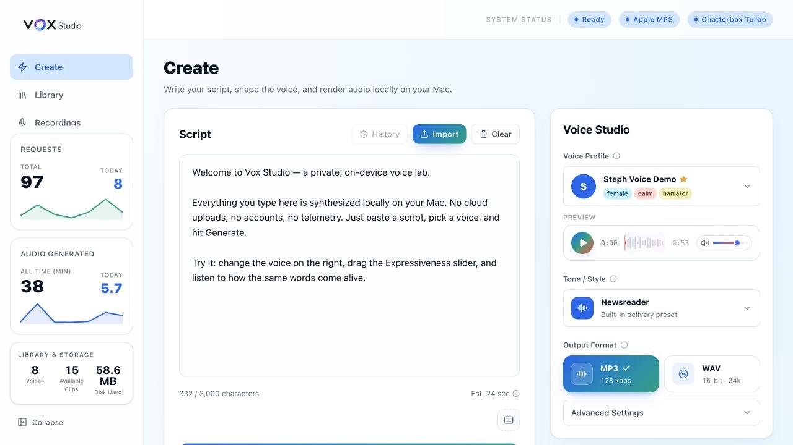
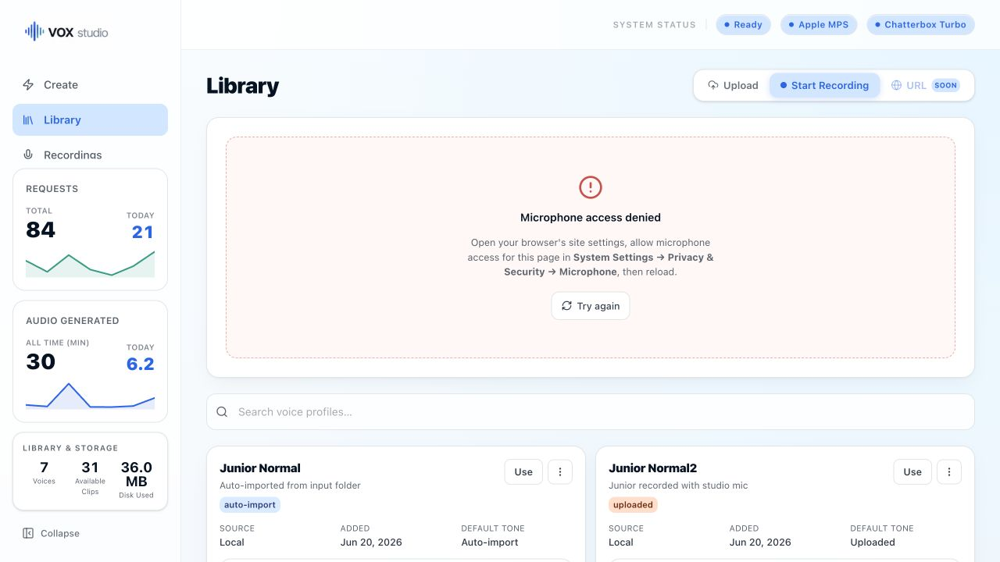
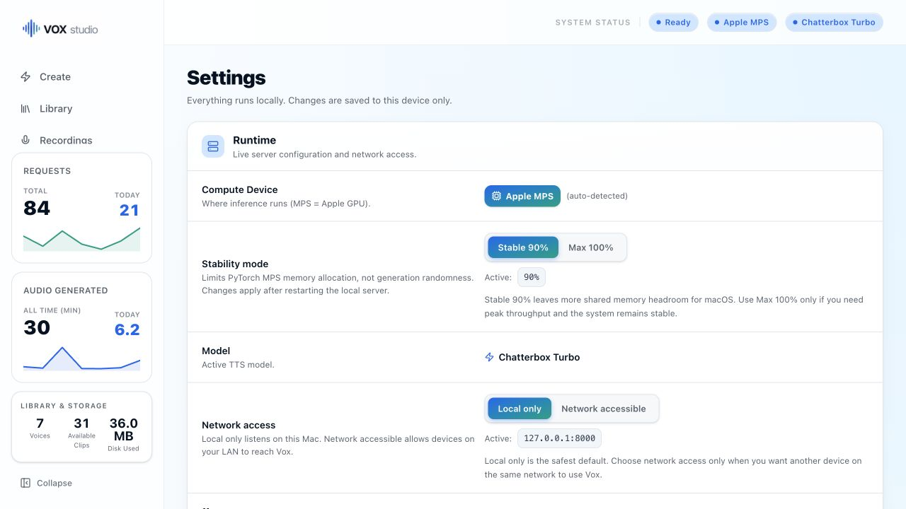

# Vox

[](https://github.com/noelmom/vox/actions/workflows/ci.yml)


A local, privacy-first text-to-speech (TTS) platform powered by [Chatterbox](https://github.com/resemble-ai/chatterbox) and optimised for Apple Silicon. Vox runs entirely on your machine — no cloud, no subscriptions, no data leaving your device.

It exposes a clean REST API and a dark-first Studio for generating high-quality audio from named voice profiles, with a signed macOS installer and native menu bar helper.

---

## Features

- **Apple Silicon MPS acceleration** — Chatterbox runs on the Metal Performance Shaders backend for fast on-device inference
- **Voice profiles** — store named voices with reference audio and per-voice TTS defaults
- **Safe local data handling** — canonical voice slugs, bounded streaming uploads, contained managed paths, validated backups, and rollback-safe restore
- **Smart presets** — built-in tones like `confident`, `calm`, `newsreader`, and `storyteller` with full per-request parameter overrides
- **Flexible audio ingest** — upload `.wav`, `.m4a`, `.mp3`, `.aiff`, `.flac`, `.ogg`, or `.webm`; all converted to WAV automatically
- **Input folder watcher** — drop a voice recording into `input/` and it registers itself automatically
- **Job history** — every generation is logged to SQLite with timing, RTF, and output path
- **Request ID tracing** — `X-Request-ID` on every request and response, tied to DB records and logs for easy HAR-file debugging
- **Configurable cleanup** — generated output files are pruned on a TTL schedule
- **Zero cloud dependency** — fully self-hosted
- **Web UI** — single-page app for generating audio, managing voices, viewing history, and configuring settings
- **Persistent creative workspace** — Create, Voices, History, and Settings share one global paused-on-reload Now Playing dock; completed-render autoplay is off by default and can be enabled in Settings (restored recordings always remain paused)
- **In-browser voice recording** — capture microphone audio directly in the browser with live waveform visualisation
- **One persistent Now Playing dock** — Create and History hand recordings to the same seekable player, while voice samples keep compact inline audition controls
- **Voice profile editing** — update description, tags, and TTS defaults without re-uploading audio
- **Tag system** — tag voices (`uploaded`, `auto-import`, or custom) with filter pills on the Voices screen
- **Custom tone** — "✦ Custom" pill opens a parameter panel with sliders for all 6 TTS params; persists via `localStorage`
- **Crash-safe generation** — one supervised model subprocess, FIFO jobs, truthful cancellation/recovery states, SSE updates, and atomic audio publication
- **Backup & restore** — export/import SQLite history and voice assets from Settings
- **Dark-first Studio** — deep-ink surfaces and signal-orange actions are the default Vox workspace theme
- **Real upload progress** — live byte-count progress bar during voice file uploads
- **macOS menu bar helper** — V-wave template icon, clear ready/stopped state, primary Open/Start-or-Restart/Pair actions, and grouped Server Controls, Files, Diagnostics, and Updates & Support menus; the icon dims while the server is unavailable or restarting
- **LaunchAgent management** — server and helper managed by macOS launchd; crash-restart, structured logs to `~/Library/Logs/Vox/`

---

## Screenshots

| Create | Library |
| --- | --- |
|  |  |

| Settings |
| --- |
|  |

---

## Architecture

```
vox/
├── api/
│   ├── main.py                  # FastAPI app, lifespan, SPA routing, settings endpoint
│   ├── middleware/
│   │   ├── request_id.py        # Attaches X-Request-ID to every req/res
│   │   └── security.py          # Host/origin checks, LAN auth, scope enforcement
│   ├── core/
│   │   ├── config.py            # All settings via VOX_ env vars or .env file
│   │   ├── db.py                # aiosqlite connection, schema migrations
│   │   ├── security.py          # Pairing codes and hashed credential store
│   │   ├── engine.py            # Lightweight model-worker status facade
│   │   ├── generation.py        # FIFO coordinator, lifecycle, encoding, atomic publication
│   │   ├── generation_worker.py # Spawned Chatterbox/MPS model owner
│   │   ├── generation_encoder.py # Killable final WAV/MP3 encoding process
│   │   ├── generation_protocol.py # Versioned coordinator/worker IPC messages
│   │   ├── presets.py           # Built-in TTS preset definitions
│   │   ├── chunker.py           # Long-text sentence splitting logic
│   │   ├── audio.py             # ffmpeg helpers: WAV conversion + MP3 export
│   │   ├── watcher.py           # Background task: watches input/ folder
│   │   ├── cleanup.py           # Background task: TTL-based output file pruning
│   │   └── logger.py            # Structured logging with request_id context
│   ├── routers/
│   │   ├── tts.py               # POST /api/v1/tts — async generation (202 Accepted)
│   │   ├── voices.py            # CRUD /api/v1/voices — manage voice profiles
│   │   ├── jobs.py              # GET /api/v1/jobs — history, status, audio download
│   │   ├── logs.py              # GET /api/v1/logs — structured job diagnostics + bounded log tails
│   │   ├── alerts.py            # GET /api/v1/alerts — install/runtime warning banners
│   │   ├── auth.py              # Pairing, devices, scoped tokens, revocation
│   │   └── presets.py           # GET /api/v1/presets — built-in + custom tone definitions
│   └── models/
│       ├── voice.py             # VoiceOut, VoiceParams, VoiceCreate schemas
│       └── job.py               # JobOut schema
├── VERSION                      # Studio/native release version used by build scripts
├── build_info.json              # Stamped version, commit, and build time copied into installs
├── ui-src/                      # React SPA source (Vite + TypeScript + Tailwind v4)
│   ├── src/
│   │   ├── routes/              # TanStack Router file-based routes
│   │   │   ├── index.tsx        # Local installed welcome page
│   │   │   ├── app.tsx          # Shell layout — sidebar, header, footer
│   │   │   ├── app.index.tsx    # Create page (TTS generation)
│   │   │   ├── app.voices.tsx   # Voices workspace (profile management)
│   │   │   ├── app.history.tsx  # History workspace (generation jobs)
│   │   │   └── app.settings.tsx # Settings page
│   │   ├── lib/
│   │   │   └── api.ts           # Typed fetch wrappers for every API endpoint
│   │   ├── components/ui/       # shadcn/ui primitives
│   │   └── assets/              # Logos, icons, screenshots
│   ├── public/                  # Static assets (favicon, etc.)
│   ├── index.html
│   ├── vite.config.ts
│   └── package.json
├── ui-dist/                     # Production build output (served by FastAPI)
├── public-site/                 # GitHub Pages marketing/download page
│   ├── index.html               # SEO-optimized public landing page
│   └── agents/SKILL.md          # Local REST API integration guide for AI agents
├── design-inspiration/          # Archived landing references and future sketches
├── voices/                      # Stored voice profile WAV files
├── outputs/                     # Generated audio files (auto-cleaned by TTL)
├── input/                       # Drop audio files here for auto-ingest
│   └── processed/               # Files moved here after successful ingest
├── voxhelper/
│   ├── main.swift               # Entry point, single-instance lock
│   ├── AppDelegate.swift        # NSApplicationDelegate lifecycle
│   ├── StatusBarController.swift # NSStatusItem, menu, all actions
│   └── ServerMonitor.swift      # Health check, .env reader, CPU/RAM stats, launchctl
├── launchagent/
│   ├── com.noelmom.vox.plist         # Server LaunchAgent template (manual start)
│   └── com.noelmom.vox-helper.plist  # Helper LaunchAgent template (auto on login)
├── scripts/
│   ├── run.sh                   # Manual foreground start (troubleshooting / dev)
│   ├── build-apps.sh            # Build, sign, and package VoxHelper + VoxServer DMG
│   ├── build-pkg.sh             # Build, sign, notarize, and staple the one-click installer package
│   ├── release.sh               # Verified-candidate finalizer; guarded tag/push/upload only with explicit publish flag
│   ├── write-build-info.sh      # Stamp VERSION + git commit + UTC build time
│   ├── install-agent.sh         # Register server LaunchAgent with macOS launchd
│   ├── uninstall-agent.sh       # Unload and remove the server LaunchAgent
│   ├── install-helper.sh        # Register menu bar helper LaunchAgent
│   ├── uninstall-helper.sh      # Unload and remove the helper LaunchAgent
│   ├── uninstall.sh             # Shared uninstall flow used by vox.sh and the helper
│   ├── update.sh                # Pull latest + sync deps + re-register agents
│   └── README.md                # Script reference + manual start guide
├── setup.sh                     # One-shot bootstrap script
├── vox.sh                       # Unified CLI — install, update, uninstall
├── AGENTS.md                    # Maintainer/AI-agent operating procedures
├── requirements.txt             # Python dependencies
├── requirements-dev.txt         # Python test/lint dependencies
├── requirements-ci.txt          # Lightweight backend deps for CI tests
├── pyproject.toml               # Pytest + Ruff configuration
├── tests/                       # Baseline backend tests
├── .github/workflows/ci.yml     # GitHub Actions CI
├── CHANGELOG.md                 # Notable changes per version
└── .env                         # Local config overrides (git-ignored)
```

---

## Quick Start

### Requirements

- macOS 13 Ventura or later
- Apple Silicon (M1 or later) — Intel Macs are not supported
- [Homebrew](https://brew.sh/) is required before running the installer. The v1 `.pkg` checks for Homebrew and fails with setup instructions if it is missing.
- Internet connection for first-time setup (Homebrew packages, Python dependencies, and model weights)
- Xcode Command Line Tools / git (`xcode-select --install`) are required only for manual clone-based installs and updates

### Method 1 — Recommended: signed `.pkg` installer

Download the latest `Vox-<version>.pkg` from [GitHub Releases](https://github.com/noelmom/vox/releases).

Open the package and follow the installer. The `.pkg` installs the Vox helper/server apps, prepares the local runtime, registers the LaunchAgents, and opens the local Welcome page after the server is reachable.

Important: install Homebrew before running the `.pkg`. Vox v1 intentionally does not install Homebrew from inside the macOS Installer flow; that bootstrap path is tracked for post-v1 polish.

The installer handles:

| Step | What it does |
|------|-------------|
| Homebrew | Checks that Homebrew is already installed |
| ffmpeg | Installs with `brew install ffmpeg` for audio conversion |
| Python 3.11 | Installs with `brew install python@3.11` for torch/Chatterbox stability |
| Virtual environment | Creates venv in `~/Library/Application Support/Vox/` |
| pip dependencies | Installs everything from `requirements.txt` |
| Runtime directories | Creates `voices/`, `outputs/`, `input/`, and `data/` |
| Demo voice | Installs the included `noelmo-demo` voice profile |
| `.env` scaffold | Writes a commented config file with all available options |
| LaunchAgents | Registers the server agent and menu bar helper |
| First-run welcome | Opens the local Welcome page when setup is ready |

The **V-wave icon** appears in your menu bar within a few seconds. Its full-strength state means the server is reachable; it dims while stopped or restarting. Open the menu for **Open Vox Studio**, the primary **Start/Restart Vox Server** action, and **Pair a Device…** when LAN access is enabled. Files, diagnostics, and update actions are grouped into submenus.

### Method 2 — Manual install from git

Use this if you want a development checkout, want to test unreleased changes, or prefer terminal-based setup.

Install Homebrew first if needed:

```bash
/bin/bash -c "$(curl -fsSL https://raw.githubusercontent.com/Homebrew/install/HEAD/install.sh)"
```

Clone and install:

```bash
git clone https://github.com/noelmom/vox.git
cd vox
bash vox.sh install
```

The manual installer walks through the same runtime setup as the `.pkg`.

**Non-interactive manual install** (CI or scripted):

```bash
bash vox.sh install --yes                        # skip all prompts
bash vox.sh install --yes --token hf_xxx         # also set HF token
```

> `.env` is git-ignored and never committed. Keep your token out of any other files.

### Start the server

Vox starts the server automatically on login by default. You can disable that from the Vox Helper menu if you prefer to start it manually.

**Via the menu bar:** click the V-wave icon → **Start Vox Server**.

**Via terminal:**

```bash
launchctl kickstart gui/$(id -u)/com.noelmom.vox          # start
launchctl stop gui/$(id -u)/com.noelmom.vox               # stop
launchctl kickstart -k gui/$(id -u)/com.noelmom.vox       # restart
tail -f ~/Library/Logs/Vox/vox.log                        # live logs
```

The menu bar helper shows `localhost:8000 · local only` when `VOX_HOST=127.0.0.1` (default), or `192.168.x.x:8000 · network accessible` when `VOX_HOST=0.0.0.0` — so you always know at a glance who can reach the server. **Pair a Device…** becomes available only when the server is running and network access is enabled.

### Updating

Release users should download and run the newest `.pkg` from [GitHub Releases](https://github.com/noelmom/vox/releases).

Manual git installs can update from the checkout:

```bash
bash vox.sh update
```

Pulls the latest from your current branch, syncs pip dependencies, and re-registers both LaunchAgents in one step.

**If you downloaded a zip instead of cloning:**
```bash
bash vox.sh update --zip /path/to/extracted-vox-folder
```
Your `.env`, `voices/`, `data/`, and `outputs/` are always preserved — only app files are replaced.

### Uninstalling

```bash
bash vox.sh uninstall               # remove agents, keep data
bash vox.sh uninstall --purge       # remove everything including voices and outputs
bash vox.sh uninstall --yes --purge # no confirmation prompts
```

---

### Manual foreground start

```bash
bash scripts/run.sh
```

Use this when the LaunchAgent isn't installed, you're debugging a startup crash and want live terminal output, or `launchctl` isn't responding and you need to rule out the agent itself. Stop the LaunchAgent first to avoid a port conflict:

```bash
launchctl stop gui/$(id -u)/com.noelmom.vox
bash scripts/run.sh
```

See [`scripts/README.md`](scripts/README.md) for a full reference of all scripts.

The server starts on `http://127.0.0.1:8000` by default — local to the Mac running Vox. Open `http://localhost:8000/app` for the web UI or `http://localhost:8000/docs` for the interactive API docs.

To allow phones, tablets, or other machines on your LAN to reach Vox, open Settings → Runtime → Network access and switch to **Network accessible**. Restart the local server for the host change to take effect. Then choose **Pair a Device…** from Vox Helper and enter its single-use five-minute code on the remote device.

Loopback Studio and API clients remain token-free. Until paired, remote devices can access only `GET /health` and the minimal pairing page/API. Browser sessions are `HttpOnly` and `SameSite=Strict`; API clients use explicit bearer tokens with `read`, `generate`, or `admin` scope. Pairing codes and raw tokens are never stored—only credential hashes are written under the installed Vox `data/security/` directory with owner-only permissions. Disabling LAN access revokes remote credentials.

Vox serves plain HTTP on the LAN unless you place it behind trusted TLS. Pair only on a trusted network and do not reuse Vox credentials elsewhere.

---

## API Reference

All responses include an `X-Request-ID` header. This ID is also stored in the `jobs` table in SQLite, making it trivial to correlate HAR files, server logs, and DB records when debugging.

You can supply your own request ID by passing `X-Request-ID` as a request header — Vox will honour it instead of generating one.

### Health

```
GET /health
```

Returns a shallow liveness check (`{"status":"ok"}`). Use this for health polling — it is not versioned and always available.

```bash
curl http://localhost:8000/health
```

---

### TTS — Generate Audio

Generation is **asynchronous**. `POST /api/v1/tts` returns `202 Accepted` immediately with a `request_id`. Poll `GET /api/v1/jobs/{request_id}` until `status` is `completed`, `failed`, `cancelled`, or `interrupted`, then download completed audio from `GET /api/v1/jobs/{request_id}/audio`.

```
POST /api/v1/tts
Content-Type: multipart/form-data
```

**Form fields:**

| Field | Type | Required | Default | Description |
|-------|------|----------|---------|-------------|
| `text` | string | ✓ | — | Text to synthesise |
| `preset` | string | | `default` | Built-in/user preset name. Built-ins include `confident`, `calm`, `soft-spoken`, `polite`, `enthusiastic`, `dramatic`, `angry`, `sarcastic`, `newsreader`, `storyteller`, and legacy `default`. |
| `output_format` | string | | `mp3` | `mp3` \| `wav` |
| `voice_name` | string | | — | Name of a stored voice profile |
| `voice` | file | | — | Upload a reference audio file directly (WAV, M4A, MP3, etc.) |
| `max_chars` | int | | 450 | Max chars per chunk (100–3000) |
| `exaggeration` | float | | preset | Override exaggeration |
| `cfg_weight` | float | | preset | Override CFG weight |
| `temperature` | float | | preset | Override temperature |
| `repetition_penalty` | float | | preset | Override repetition penalty |
| `top_p` | float | | preset | Override top-p |
| `min_p` | float | | preset | Override min-p |

**Parameter precedence:** `preset defaults → voice profile defaults → request overrides`

**202 response body:**

```json
{ "request_id": "abc123-..." }
```

Listen to `GET /api/v1/jobs/{request_id}/events` for server-sent job updates, or poll `GET /api/v1/jobs/{request_id}` as a fallback. Durable states are `queued`, `processing`, `cancelling`, `encoding`, `recovering`, `completed`, `failed`, `cancelled`, and `interrupted`. A coordinator serializes jobs through one spawned model owner; cancellation is terminal only after that worker exits, and a replacement never starts while the old worker is alive.

For an installed Apple Silicon build, run `python3 scripts/smoke-generation-recovery.py` while Vox is open. It cancels an active render, confirms the original worker PID is gone, waits for a distinct replacement, and verifies a second render completes. Set `VOX_SMOKE_BASE_URL` or `VOX_SMOKE_TOKEN` when testing a non-default or paired endpoint.

**Response headers (on the 202):**

| Header | Description |
|--------|-------------|
| `X-Request-ID` | Unique ID for this request — matches the DB job record |

**Examples:**

```bash
# Queue a generation with a stored voice profile
curl -X POST http://localhost:8000/api/v1/tts \
  -F "text=Hello, this is Vox speaking." \
  -F "preset=default" \
  -F "voice_name=noelmo-demo"
# → { "request_id": "abc123-..." }

# Poll until completed, then download
curl http://localhost:8000/api/v1/jobs/abc123-...          # check status
curl http://localhost:8000/api/v1/jobs/abc123-.../audio \  # download when completed
  --output output.mp3

# Generate with the enthusiastic preset
curl -X POST http://localhost:8000/api/v1/tts \
  -F "text=This is going to be huge!" \
  -F "preset=enthusiastic" \
  -F "output_format=mp3"

# Upload a voice file inline (M4A from iPhone Voice Memos)
curl -X POST http://localhost:8000/api/v1/tts \
  -F "text=Testing my own voice clone." \
  -F "voice=@/path/to/recording.m4a"

# Override individual params
curl -X POST http://localhost:8000/api/v1/tts \
  -F "text=Calm and measured delivery." \
  -F "preset=newsreader" \
  -F "exaggeration=0.1" \
  -F "cfg_weight=0.8"

# Supply your own request ID for tracing
curl -X POST http://localhost:8000/api/v1/tts \
  -H "X-Request-ID: my-trace-id-001" \
  -F "text=Traceable request."
```

---

### Voices — Manage Voice Profiles

Voice profiles store a reference WAV file plus optional TTS parameter defaults. When a voice is used in `/api/v1/tts`, its stored defaults sit between the preset and any per-request overrides.

```
GET    /api/v1/voices              List all voice profiles
GET    /api/v1/voices/{name}       Get a single voice profile (includes file_available bool)
POST   /api/v1/voices              Upload and register a voice
PATCH  /api/v1/voices/{name}       Update description or TTS defaults (no re-upload needed)
DELETE /api/v1/voices/{name}       Delete voice profile and its WAV file
```

**Upload a voice (WAV, M4A, MP3, AIFF, FLAC, OGG, WebM accepted):**

```bash
curl -X POST http://localhost:8000/api/v1/voices \
  -F "name=my-voice" \
  -F "description=Calm narrator, recorded in quiet room" \
  -F "exaggeration=0.4" \
  -F "cfg_weight=0.6" \
  -F "file=@/path/to/recording.m4a"
```

Non-WAV files are automatically converted to 16-bit 44.1 kHz mono WAV on ingest. The original filename is preserved in the DB.

**Update TTS defaults without re-uploading:**

```bash
curl -X PATCH http://localhost:8000/api/v1/voices/my-voice \
  -F "exaggeration=0.6" \
  -F "description=Updated description"
```

**Drop-folder ingest:**

Any audio file placed in the `input/` folder is automatically detected (polled every 10 seconds), converted to WAV, and registered as a voice profile using the filename stem as the voice name. The original file is moved to `input/processed/` on success. Accepted formats: WAV, M4A, MP3, AIFF, FLAC, OGG, WebM.

```bash
# Example: iPhone Voice Memo dropped into input/
cp ~/Downloads/Voice\ Memo.m4a ./input/my-voice.m4a
# → voice "my-voice" appears in /api/v1/voices within 10 seconds
```

---

### Jobs — Generation History & Audio Download

```
GET /api/v1/jobs                          List recent jobs (newest first)
GET /api/v1/jobs/{request_id}             Get a specific job (includes file_available bool)
GET /api/v1/jobs/{request_id}/events      Stream job status events
GET /api/v1/jobs/{request_id}/audio       Download the generated audio file
POST /api/v1/tts/{request_id}/cancel      Cancel a queued/running generation
DELETE /api/v1/jobs/{request_id}          Delete a job row and its generated file
GET /api/v1/backups/export                Download DB + voice backup zip
POST /api/v1/backups/restore              Restore DB + voice backup zip
```

```bash
# List last 50 jobs
curl http://localhost:8000/api/v1/jobs

# Poll a specific job until completed
curl http://localhost:8000/api/v1/jobs/abc123-...

# Download audio once status == "completed"
curl http://localhost:8000/api/v1/jobs/abc123-.../audio --output output.mp3

# Cancel a queued/running generation
curl -X POST http://localhost:8000/api/v1/tts/abc123-.../cancel

# Paginate
curl "http://localhost:8000/api/v1/jobs?limit=20&offset=40"
```

Job fields include: `request_id`, `status`, `text`, `voice_name`, `preset`, `output_format`, `output_path`, `file_available`, `chunks`, `audio_duration_s`, `generation_s`, `total_s`, `rtf`, `device`, `error`, `created_at`, `completed_at`.

---

### Presets

```
GET /api/v1/presets         Return all preset definitions (built-in + user-saved)
```

Built-in presets:

| Preset | Character | Use case |
|--------|-----------|----------|
| `confident` / `default` | Balanced | General purpose |
| `calm` | Low-key | Measured narration |
| `soft-spoken` | Gentle | Quiet reads and softer delivery |
| `polite` | Clear | Helpful assistant-style reads |
| `enthusiastic` | High energy | Promos, upbeat narration |
| `dramatic` | Expressive | Story beats and trailers |
| `angry` | Intense | Stylized emotional takes |
| `sarcastic` | Dry | Wry or comedic delivery |
| `newsreader` | Flat, authoritative | News reading, documentation |
| `storyteller` | Warm, expressive | Narrative scripts |

---

## Configuration

All settings are controlled via environment variables with a `VOX_` prefix, or by editing `.env` in the project root. Start from [`.env.example`](./.env.example) and copy it to `.env` if you want a ready-made template. The `.env` file is git-ignored and created automatically by `setup.sh`.

| Variable | Default | Description |
|----------|---------|-------------|
| `VOX_HOST` | `127.0.0.1` | Bind address. Use `127.0.0.1` for local-only access or `0.0.0.0` for LAN access. Host changes require restarting the local server. |
| `VOX_PORT` | `8000` | Port to listen on |
| `VOX_DEVICE` | `auto` | `auto` \| `mps` \| `cpu` |
| `VOX_FFMPEG_PATH` | `/opt/homebrew/bin/ffmpeg` | Path to ffmpeg binary |
| `VOX_OUTPUT_TTL_HOURS` | `24` | Hours to keep generated output files. `0` = keep forever. |
| `VOX_WATCHER_INTERVAL_S` | `10` | How often (seconds) the input folder is polled |
| `VOX_CLEANUP_INTERVAL_S` | `3600` | How often (seconds) the cleanup task runs |
| `VOX_DEFAULT_MAX_CHARS` | `450` | Default hard maximum characters per generation chunk when an API request does not pass `max_chars`. Editable in Settings as **Default per-chunk max**. |
| `VOX_MAX_SCRIPT_CHARS` | `100000` | Maximum total script length accepted by one generation request. |
| `VOX_MAX_VOICE_UPLOAD_MB` | `50` | Maximum stored or inline voice upload size; uploads stream to bounded temporary files. |
| `VOX_VOICE_ICON_MAX_KB` | `100` | Maximum decoded PNG icon size; dimensions are also limited to 1024×1024. |
| `VOX_MAX_BACKUP_UPLOAD_MB` | `2048` | Maximum compressed restore archive size. |
| `VOX_MAX_BACKUP_EXPANDED_MB` | `4096` | Maximum total expanded restore size. |
| `VOX_MAX_BACKUP_ENTRIES` | `10000` | Maximum number of entries accepted in a restore archive. |
| `VOX_MIN_MAX_CHARS` | `100` | Minimum allowed per-request `max_chars` value |
| `VOX_MAX_MAX_CHARS` | `3000` | Maximum allowed per-request `max_chars` value |
| `VOX_CHUNK_HEADROOM_CHARS` | `40` | Buffer subtracted from the per-chunk max when Vox packs sentences. Example: `450 - 40 = ~410` character soft packing target. Invalid or empty values fall back to 40. |
| `VOX_MAX_VOICE_CLIP_DURATION_S` | `120` | Maximum allowed uploaded/recorded voice clip length in seconds. Invalid or empty values fall back to 120. |
| `HF_TOKEN` | *(none)* | HuggingFace access token. Only needed the first time the model is downloaded — without it, downloads are anonymous and subject to HuggingFace rate limits. Has no effect on generation speed once the model is cached locally. Uses the standard HF convention (no `VOX_` prefix). Generate a read-only token at [huggingface.co/settings/tokens](https://huggingface.co/settings/tokens). **Never commit this value to git.** |

> **Note:** The menu bar helper (`VoxHelper.app`) reads `.env` on startup and uses the configured `VOX_PORT` for all health checks and API calls. If you change `VOX_PORT`, restart the helper for the change to take effect.

**Example `.env`:**

```env
VOX_HOST=127.0.0.1
VOX_PORT=8000
VOX_OUTPUT_TTL_HOURS=48
VOX_DEFAULT_MAX_CHARS=450
VOX_CHUNK_HEADROOM_CHARS=40
VOX_MAX_VOICE_CLIP_DURATION_S=120
VOX_DEVICE=mps
HF_TOKEN=hf_xxxxxxxxxxxxx
```

The same template lives in [`.env.example`](./.env.example) for easy copying and reference.

---

## Debugging & Tracing

Every request gets a `X-Request-ID` (UUID4) attached to:
- The HTTP response header
- The `jobs` table row in `vox.db`
- Every log line emitted during that request

This means you can:
1. Grab a `X-Request-ID` from a HAR file or curl `-v` output
2. Query the DB: `SELECT * FROM jobs WHERE request_id = '<id>';`
3. Grep the logs: `grep '<id>' ~/Library/Logs/Vox/vox.log`

To inspect the database directly:
```bash
sqlite3 ~/Library/Application\ Support/Vox/data/vox.db
> SELECT request_id, status, preset, audio_duration_s, rtf, created_at FROM jobs ORDER BY created_at DESC LIMIT 10;
```

---

## Stack

| Layer | Technology |
|-------|-----------|
| TTS Engine | [Chatterbox](https://github.com/resemble-ai/chatterbox) |
| Backend | [FastAPI](https://fastapi.tiangolo.com/) + Uvicorn |
| Acceleration | Apple MPS (Metal Performance Shaders) |
| Database | SQLite via [aiosqlite](https://github.com/omnilib/aiosqlite) |
| Audio conversion | ffmpeg |
| Job queue | `asyncio.Lock` (single-device serialisation) |
| Settings | [pydantic-settings](https://docs.pydantic.dev/latest/concepts/pydantic_settings/) |
| Web UI | React 19 + TypeScript, Vite 6, Tailwind CSS v4, TanStack Router + Query |
| Menu bar helper | Native Swift (AppKit `NSStatusItem`) — arm64 macOS only |
| Process management | macOS launchd via LaunchAgent plists |
| Packaging | Signed/notarized macOS `.dmg` and `.pkg` via `scripts/build-apps.sh` and `scripts/build-pkg.sh`; `scripts/release.sh` finalizes a verified candidate |
| CI | GitHub Actions: Ruff, codespell, pytest, TypeScript typecheck, Vite build, shell syntax |

---

## Roadmap

Vox is now in a v1.0 scope freeze: only bug fixes, product polish, and true blockers should be added before v1.0. Post-v1 work is tracked through GitHub Issues with the `enhancement` label.

- [x] Chatterbox engine wrapper with MPS/CPU auto-detect
- [x] FastAPI backend with async generation lock
- [x] Built-in presets with per-request param overrides
- [x] Long-text chunking with sentence-boundary splitting and medium-script sentence packing
- [x] WAV and MP3 output via ffmpeg
- [x] Voice profile management with SQLite registry
- [x] Per-voice TTS parameter defaults
- [x] Multi-format audio ingest (M4A, MP3, AIFF, FLAC, OGG → WAV)
- [x] Input folder auto-watcher
- [x] Job history with full timing metrics
- [x] X-Request-ID tracing across HTTP, DB, and logs
- [x] TTL-based output file cleanup
- [x] Environment-based configuration
- [x] One-command setup script (`setup.sh`)
- [x] Web UI — Create, Library, Recordings, Settings screens (React SPA)
- [x] Voice profile tagging, filter pills, and search
- [x] Voice profile editing — display name, description, tags, custom icon
- [x] Favorites — starred voices persist in SQLite, survive restarts and device changes
- [x] In-browser microphone recording with live waveform
- [x] Voice profile audio preview player with seek and volume
- [x] Custom tone panel — per-request TTS parameter sliders, named presets saved to DB
- [x] Custom tone update/save-as flow for saved user presets
- [x] Generation status — queued/running state, elapsed timer, SSE updates, polling fallback, global status bar, and cancel controls
- [x] Backup & restore — export/import SQLite history and voice assets from Settings
- [x] Dark-first Studio theme — deep-ink surfaces and signal-orange actions are the default workspace treatment
- [x] Result download with format and quality controls
- [x] Recent recordings with inline play, download, and delete
- [x] Persistent generation error UI with retry/dismiss and request ID copy
- [x] macOS menu bar helper (native Swift) — monochrome VOX status icon, CPU/RAM, server control, copy address
- [x] LaunchAgent for server (manual start, crash-restart, structured logs)
- [x] LaunchAgent for helper (auto-starts on login)
- [x] Swift menu bar rewrite — native AppKit, eliminates Python/PyObjC issues on macOS Sequoia
- [x] One persistent Now Playing dock for generated recordings; compact waveform controls remain only for voice audition, recording, and trimming
- [x] Microphone error classification — distinct UI for no-device / access-denied / insecure context
- [ ] Post-v1: manual pause insertion in the Create script editor
- [ ] Post-v1: pronunciation dictionary / word replacement controls
- [ ] Post-v1: offer a supported light/system appearance preference without compromising the dark-first Studio contract
- [ ] Post-v1: streaming audio response (chunked transfer)
- [ ] Post-v1: review Python and JavaScript SDK support after the local REST API stabilizes
- [ ] Post-v1: single self-contained `.app` packaging, separate from the current signed/notarized `.pkg` + `.dmg` release flow
- [x] Auto-launch on login — server and helper both auto-start by default; users can disable either from Vox Helper

---

## Contributing

Please read [CONTRIBUTING.md](CONTRIBUTING.md) before opening a pull request.

Public workflow:

- Bugs and feature requests start as GitHub Issues.
- Enhancements use the `enhancement` label.
- Pull requests should link to an issue.
- CI must pass before merge.
- `main` is the stable release branch and is maintainer-merged only.

---

## License

Vox is released under the [MIT License](LICENSE).
